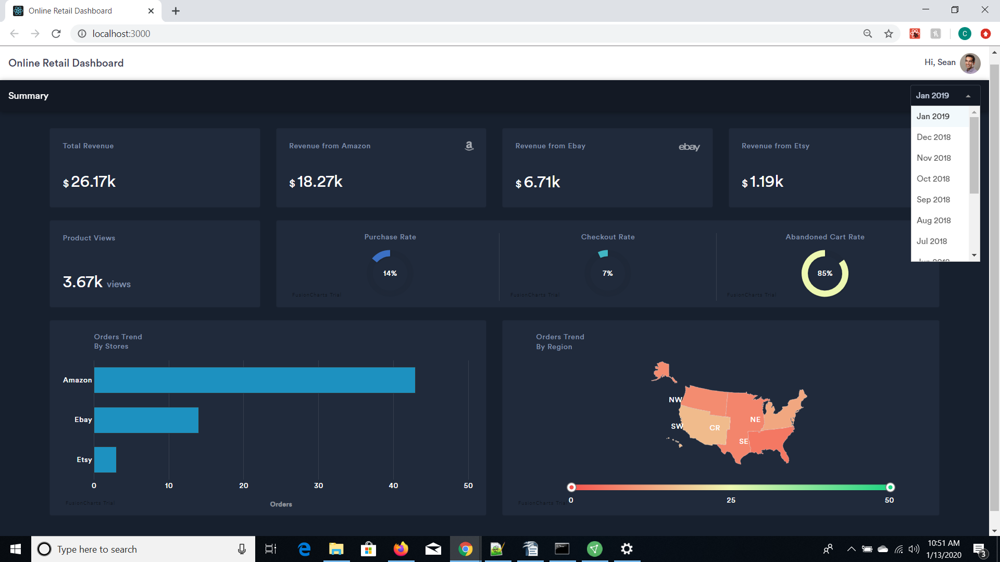
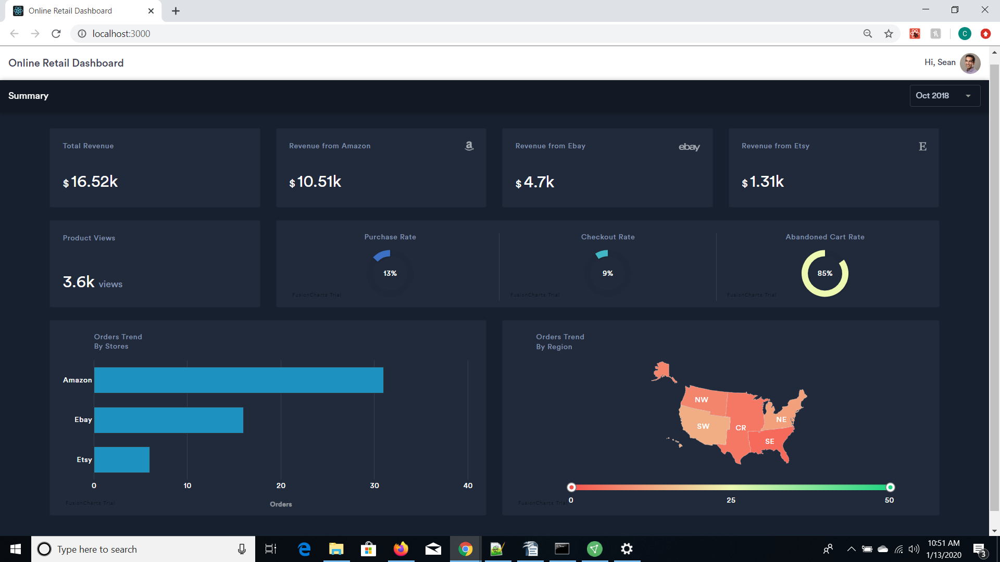
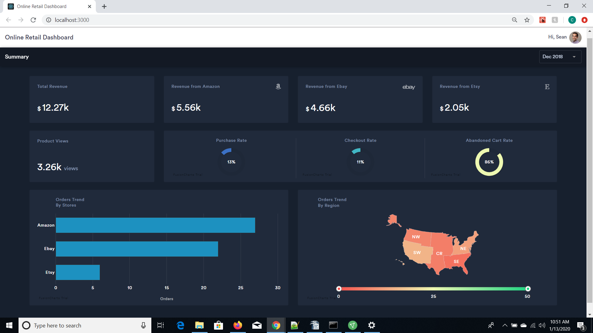
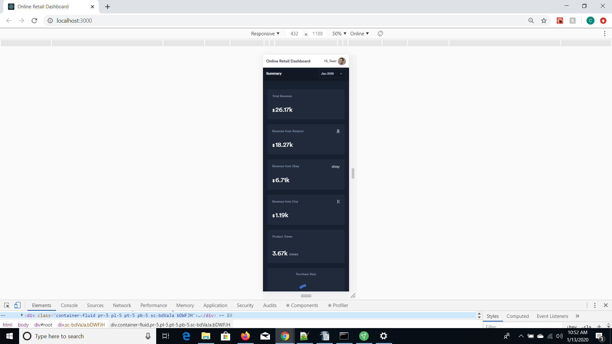
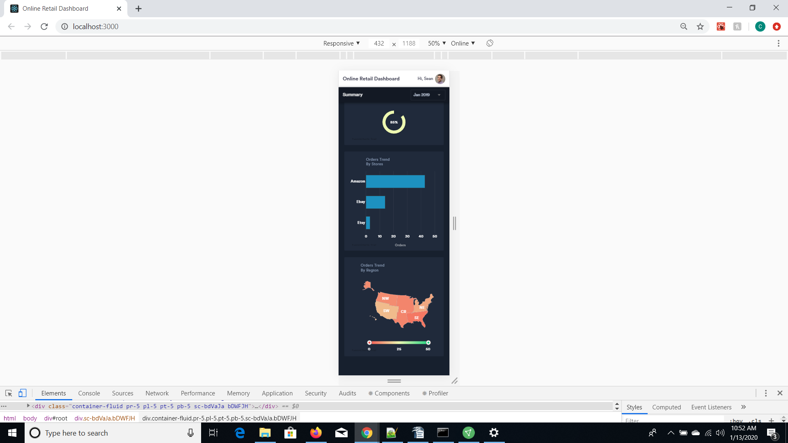

# Online Retail Dashboard using React, FusionCharts, Google Sheets & Boostrap

## Live Project: [Demo Link](https://cshah35-analytics.netlify.app/)

**Steps to run the project**:
1. After cloning the repository, use `npm install` to install all the dependencies needed.
2. Run `npm start` to run project in development server. (Refer to more scripts mentioned below)

## Available Scripts

In the project directory, you can run:

### `npm start`

Runs the app in the development mode. Open [http://localhost:3000](http://localhost:3000) to view it in the browser.

The page will reload if you make edits. You will also see any lint errors in the console.

### `npm run build`

Builds the app for production to the `build` folder. It correctly bundles React in production mode and optimizes the build for the best performance.

The build is minified and the filenames include the hashes. See the section about [deployment](https://facebook.github.io/create-react-app/docs/deployment) for more information.

This project was bootstrapped with [Create React App](https://github.com/facebook/create-react-app).

### Screenshots ###

